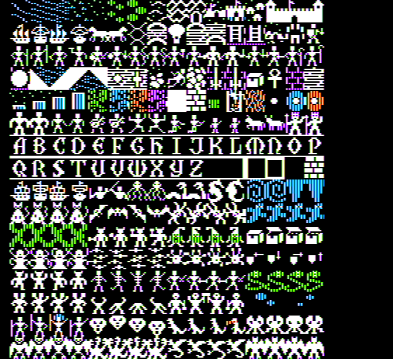

# Ultima 4

* 

Ultima IV requires an 64K Apple because the tiles for Ultima 4 are stored in the 16K Language Card RAM.

Specically, each sprite/tile is 14 x 16 px due to the Apple ]['s high resolution graphics screen being 280x192.

```
; Sprites are 14x16 px
; LC Bank1 = Sprite Odd  Columns (Left  half of tile)
; LC Bank2 = Sprite Even Columns (Right half of tile)
; $D000 = Sprite Scanline 0
; $D100 = Sprite Scanline 1
; $D200 = Sprite Scanline 2
; $D300 = Sprite Scanline 3
; $D400 = Sprite Scanline 4
; $D500 = Sprite Scanline 5
; $D600 = Sprite Scanline 6
; $D700 = Sprite Scanline 7
; $D800 = Sprite Scanline 8
; $D900 = Sprite Scanline 9
; $DA00 = Sprite Scanline A
; $DB00 = Sprite Scanline B
; $DC00 = Sprite Scanline C
; $DD00 = Sprite Scanline D
; $DE00 = Sprite Scanline E
; $DF00 = Sprite Scanline F
```

Last updated: May 9, 2020.
